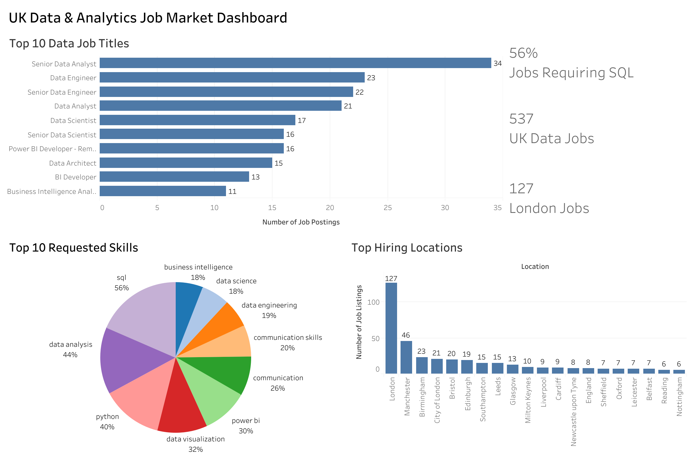

# UK Job Market Analysis

Analysed UK data and analytics job postings using PostgreSQL and Tableau to identify the most in-demand skills, hiring locations and job titles.

## Tech Stack

- PostgreSQL
- SQL
- Tableau
- CSV
- Kaggle

## Dataset

The original dataset contained over **1.3 million LinkedIn job postings**. Using PostgreSQL, I filtered the data down to **UK data and analytics roles** for analysis.

The dataset was sourced from Kaggle and includes job postings, summaries and extracted skills.

## Workflow

```text
Import CSV Files
        ↓
Create Relational Database
        ↓
Create SQL Views
        ↓
Analyse Skills, Locations & Job Titles
        ↓
Export Query Results
        ↓
Build Tableau Dashboard
```

## Dashboard

The final Tableau dashboard explores the UK data and analytics job market through three visualisations:

- Top Requested Skills
- Top Hiring Locations
- Most Common Job Titles



## Key Insights

- SQL was the most requested skill across the analysed roles.
- London had the highest concentration of data and analytics vacancies.
- Power BI appeared more frequently than Tableau in job requirements.
- PostgreSQL made it possible to efficiently filter, validate and analyse over 1.3 million job postings.

## Folder Structure

```text
uk-job-market/
│
├── images/
├── sql/
│   ├── 01_create_tables.sql
│   ├── 02_create_views.sql
│   ├── 03_data_validation.sql
│   ├── 04_skills_analysis.sql
│   ├── 05_location_analysis.sql
│   └── 06_job_title_analysis.sql
│
└── README.md
```

## Future Improvements

- Standardise similar job titles.
- Merge duplicate skill names.
- Include salary and remote working analysis.
- Compare trends across different countries and over time.
